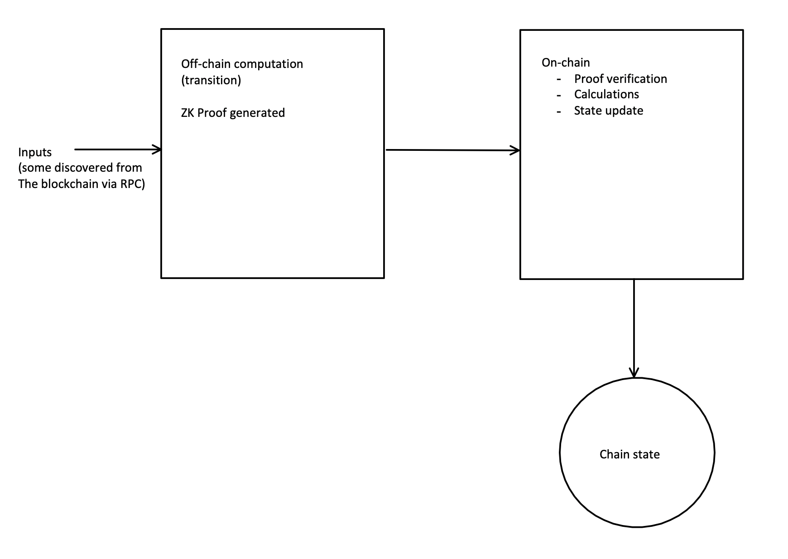
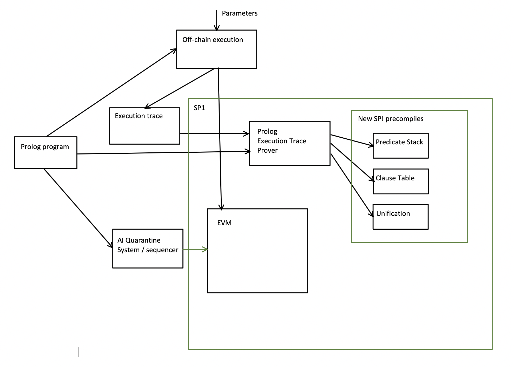

# Zircuit Prolog Pre-execution

## Abstract

Zircuit as Validium (popularly but imprecisely called ZK) Layer 2 EVM blockchain is transitioning from execution proof generation using Halo 2 to using Succinct Labs SP1.
Among other benefits, this presents an opportunity to offload most on-chain computation, move it off-chain and compress it to merely a ZK verification on-chain.
Instead of procedural we consider implementing this computation in a declarative language such as Prolog. This can produce an execution trace that would speculatively be understandable to AI models, such as the ones that can be used in Zircuit's pre-execution transaction Quarantine system. This arguably would 
improve the insightfulness in the process of detecting fraudulent transactions. On top of this, the pre-calculation can include assertions that could allow for pre-screened policies, in addition to the Zircuit's existing Customizable Transaction Policies for Institutions.

## Prior Work

For full disclosure, I attempted to implement a simplified Prolog interpreter in Cairo for deployment on the Starknet blockchain during a previous ETHGlobal hackathon. However, due to Starknet’s computational-budget constraints at the time and Cairo’s lack of efficient data structures, I abandoned the project and haven’t revisited it since.

## Introduction

### Quarantine

The Zircuit blockchain runs an AI model for each transaction (and block) in order to determine if the transaction in malicious and not include it in the upcoming block, but
instead quarantine it for further consideration.

While Zircuit includes an AI-driven quarantine mechanism, it also offers Customizable Transaction Policies for KYC-verified institutions—allowing them to bypass those quarantine checks on transactions they initiate. Since blockchains were originally conceived to guard against the failings of institutions and governments, this feature risks undermining that very principle.

In addition, protocols and users may fear quarantine even if it is extremely unlikely,
as it is performed by trained models, which could conceivably err. A landing protocol
or lender would not like to see genuine liquidations quarantined or even minimally
delayed. A trader would not like to miss a stop-loss order because of quarantine, etc.

This article proposes a more refined analysis of the incoming transactions to
possibly improve this process.

### Pre-execution: the example of Aleo

Let us look at [Aleo](https://developer.aleo.org/concepts/network/core_architecture), as an example of off-chain pre-computing. For the sake of this explanation
let us ignore the privacy aspect and assume that all computation is public.
This compression of computation has been known for decades (reference needed), but let us look at it from the blockchain aspect.



The programs in Aleo's language Leo have two parts for each entry point:

- "transition" - this part is executed off-chain. All necessary data on which it operates is
passed to it as parameters. If any part of that comes from the blockchain state, it is
pre-fetched before it is passed as parameter(s). The transition creates a proof of computation, and then it passes it to the next stage along with the public inputs, to be completed on-chain.
- "async function" - this part is executed on-chain. It receives the proof and the public inputs from the "transition". After the verification of the proof, it uses the public inputs as parameters to the on-chain function execution. This usually includes matching of
the on-chain state against the pre-fetched data and recording of the state changes.

In the above, most of the computation work should be completed off-chain in the "transition", relieving the blockchain of the heavy work.

If we look at Zircuit, all on-chain work proven and the new state and proofs are recorded
anyway, so off-loading the work off-chain would not add overhead in any case. We argue that it would actually reduce load, especially if the off-chain work is recorded as
execution trace, with all non-deterministic search (or guesswork) is eliminated from it.

### Prolog and Non-determinism

Prolog is a very simple declarative programming language. It's name stands for "Programming in Logic". Prolog programs are collections of "sentences" that describe
definitions of "predicates". For example, the predicates "parent" and "grandparent"
can be defined as:

```
grandparent(A, C) :- parent(A, B), parent(B, C).

parent(adam, seth).
parent(seth, enosh).
parent(adam, cain).
```

The upper case letters are "variables" which can be instantiated with terms such as numeric or literal constants (```5``` or ```adam```), or complex terms such as ```t(5, adam)```.

The above program means:
$(\forall A, C, B: grandparent(A, C) \vee \lnot parent(A, B) \vee \lnot parent(B, C)) \wedge$<br/>
$parent(adam, seth) \wedge parent(seth, enosh) \wedge parent(adam, cain)$

The execution of the program starts with a query such as:
```
?- grandparent(X, enosh).
```
which responds with:
```
X = adam
```
and we can ask for alternative solutions if there is more than one, but that is beyond the point of our discussion.

Prolog as such is incomplete, as it's clauses are of the form:
```
A :- B, C, ...
```
cannot express everything first order predicate logic can. Kowalski (Kowalski, Robert. “Logic for Problem Solving.” Elsevier Science Ltd, 1979) has shown that any first order logic
statement can be expressed as a set of so called "Horn Clauses" of the form:
```
A, B, ... :- C, D, ... 
```
Each such Horn Clause can be translated into the usual logic symbolic:

$A \vee B \vee ... \Leftarrow C \wedge D \wedge ... $

and each of these ```A, B, C, D``` is in the form of the Prolog predicates. To remedy
this, Prolog introduces the ```!``` ("cut") operator which aborts the search for solution.
Prolog performs its search for solution in a depth-first manner. This makes Prolog
as expressible as First Order Predicate Logic under the assumption of "what we cannot
prove is not true" inside its programs.

So, for example "not" is defined as (not exactly correct Prolog syntax):
```
not(X) :- X, !, fail.
```

The execution of Prolog consists of the following:
- **Unification** of terms such as ```x(a, X, Y)``` and ```x(Z, b, Y)``` resulting in ```x(a, b, Y)```.
- **Searching** for match of the current predicate we are trying to match against clauses that define that predicate in the program.
- **Abortion** of search in the current branch once the ```!``` operator is encountered.

This represents a Turing-complete execution. Yet, this search can involve a lot of computation, as the Prolog programs include non-determinism as in the definition of ```parent(X, Y)``` above.

It is important that the result of the Prolog execution can be expressed as **Execution Trace** which can be much smaller than the number of steps in the search, as it only
contains the successful branch of the search. Note that in the Execution Trace the
unsuccessful branches that lead to a failure after ```!``` have to be included as well. Yet, this does not impose excessive overhead. This part of the discussion can be expanded,
but it is well known.

Just a curiosity note, a Non-deterministic Polynomial time problem (NP-time problem) is one for which there is an algorithm that can solve it using a non-deterministic machine in time
bounded by a polynomial of it's input size. Yet the resulting solution can be checked by a deterministic machine in time polynomial of it's input size (P-time). If we feed the solution into a ZK prover such as SNARK or STARK, the proving time is bound by a polynomial time, so proving a ready execution trace is P-time for and NP-time problem.

## Opportunity

Just like in Aleo we can split the execution of smart contracts in Zircuit in two parts:
- Off-chain execution. No private variables would be used. Everything is public. The program would be defined in Prolog, which produces relatively short execution trace (P-size for NP-time problem). A succinct ZK proof would be generated in P-time, where the
proof would be poly-log size for STARK proofs or even constant size if the STARK proof verification is proven in a SNARK proof.
- On-chain execution. Same as usual EVM execution. At the beginning of the call, a verification of the proof of the off-chain execution would be performed. Then everything else is as usual. Yet majority of the on-chain computation can be offloaded off-chain.

## Proposed Implementation

No modification to the EVM part is needed at all. Users that take advantage of this
system can simply put the verification of the proof in the first line.

Here are some additions that are needed:
- The Prolog program can optionally be stored on-chain, if it is to be utilized by the
AI Quarantine system. For the sake of verification,
the verifier (verification key, in alternative terminology) already represents a commitment to the off-chain Prolog program. However, we want to feed this program to the
AI Quarantine model, along with the execution trace, so it can intelligently decide
what the program does and if it is dangerous.
- The off-chain execution trace can also be optionally sent on-chain. If so, it would improve the
AI Quarantine system. Otherwise, nothing else would be changed for the existing applications.
- The off-chain execution proof has to be sent on-chain if it is used. For existing applications this is not needed, but applications that use this system would need to
verify this proof in order to proceed.

The new architecture would be:



There is absolutely no change to the existing system or deployed applications.

In addition, new applications would be able to utilize Prolog for client-side computing,
as well as submit the off-chain program upon deployment and execution trace upon each call
for better indemnification of their behavior by the AI model.

### Why is this easy to implement?

The proposed architecture is very easy to implement. The reasons are:
- The SP1 infrastructure already exists (or will exist in the upcoming version).
- The new components are independent of the existing system.

The Prolog implementation is relatively simple, and maybe an existing implementation can
be adapted. It exists in JavaScript/TypeScript, and it can be adapted as a library that can be included and call within the application front ends.
A simple Prolog interpreter can be written in Prolog itself, which outputs the execution trace along with the result.

The proving system is much simpler than the one for execution of the EVM:
- There is no state because it executes on the client side. Consequently there are 
no methods for fetching parts of the state from Merkle-Patricia or Verkle Tries, etc.
- There is no large set of instructions.

Here is the outline of the proving system:
- The program can be stored in an ordered table of clauses. Multiple clauses with same "head" (the left side; predicate) can exist for a single predicate, which stems from the
non-determinism.
- For each step of the execution trace the **Unification** of terms (parameters) has to be
checked (constrained). The unification takes 2 terms and replaces the uninstantiated variables on one side with potentially instantiated values on the other.
- As the matched head of a Prolog clause can have multiple terms on the right, they
have to be pushed to a stack, popped when encountered in the execution trace and the
final result should be an empty stack.

Considering the simplicity of the above operations, special SP1 "precompiles" can
be developed for table membership checking, term Unification, and stack implementation. The only remaining part is looping through the execution trace and checking that at the end of the loop, the stack is empty.

Note that Prolog needs 2 stacks (call stack + backtrack stack) for execution. However, 
for checking of the execution trace it only needs one, as the non-determinism is already
settled by the time we have a complete execution trace.

The verification system is already there. There should already be an SP1 precompile
for the EVM pairing function precompiles needed for the verifier. Most likely, there
is already an SP1 precompile for proving a STARK verification into a SNARK proof.

Note that the Prolog execution trace proving system does not have to execute in the same instance of SP1 as the Zircuit EVM. It could optionally be executed as one of the following:
- Inside Zircuit SP1.
- Inside SP1 on some prover infrastructure service.
- On the client's computer.

## Other Considerations

Presently the off-chain calculations are done by the front-end, usually in JavaScript or
TypeScript. As such they are hard to prove and compress, so consequently they cannot contain calculations that are trusted by the on-chain contracts. They can merely feed
information to the contracts as input parameters and/or read the chain state via ```view``` functions.

To convert JavaScript or TypeScript execution into a succinct proof is too complicated.
However, EVM implementation and its execution proof generation already exists, as the blockchain needs it. Why wouldn't we
adapt this implementation and use it off-chain? This is because the AI reasoning about sequential calculation post mortem would be very difficult. The Prolog execution trace,
on the other hand, contains meaningful information. On top of that, the compression of
non-deterministic calculation onto a ZK proof is much larger.

## Expected Benefits

### No changes to Existing Apps

As the EVM is untouched, and the AI Quarantine
sequencer system is unchanged, the existing applications would not see any change in behavior.

### Reduction of Cost and Speedup

As computation is offloaded from the blockchain, most of it's function would reduce to checking and state updates, all done using the usual EVM. Most of the computation would be done off-chain. And not only off-chain, but also off-proof, as the Prolog program does most of the solution searching to produce a relatively short execution trace. Only the execution trace is fed into the prover, and
not the entire execution. This reduces the proving time significantly.

### Quarantine system improvement

As the Prolog execution trace contains meaningful calculations and constrain checks, the AI model can easily understand them, parse them and possibly quarantine more programs justifiably. For example, it could understand that wrapping large amounts of tokens and providing virtual liquidity could be a genuine function of an atomic liquidation program.